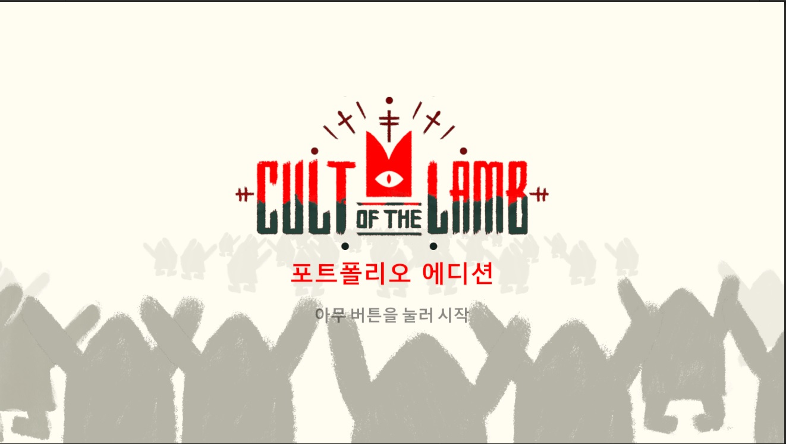
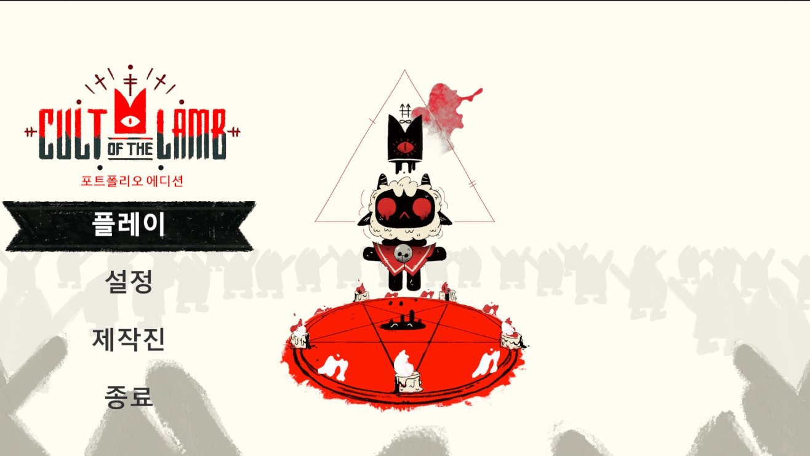
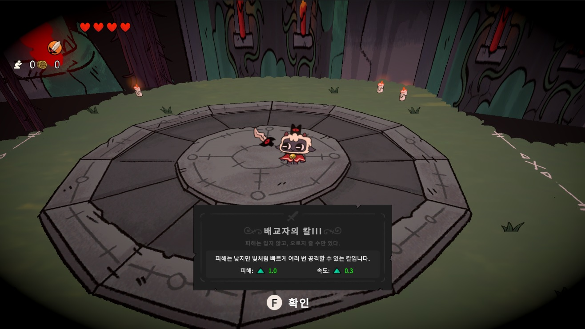
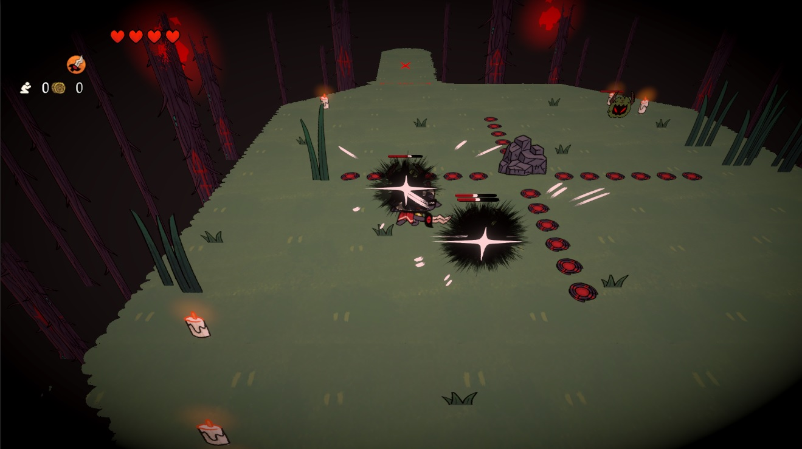
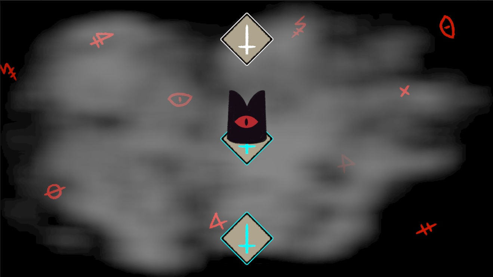
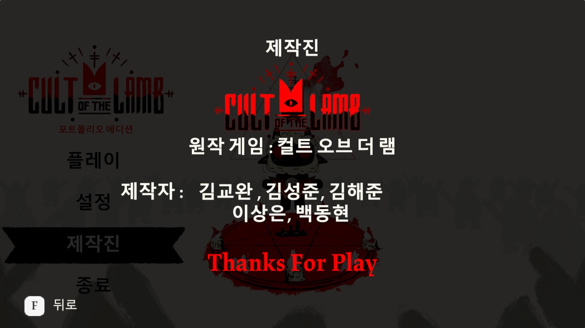

# 모작_컬트 오브 더 램

5인 팀이 3주 동안 제작한 컬트 오브 더 램 모작. 4개 스테이지 + 1개 보스전, URP + Spine 환경에서 구현.

본 프로젝트는 교육/연습 목적의 모작입니다

# 스크린샷
 
 
 

# 게임 개요

장르: 액션 어드벤처(모작)

개발 인원: 5명

개발 기간: 3주

콘텐츠: 4개 스테이지 + 1개 보스전

그래픽/애니메이션: Spine 사용, URP 환경

플랫폼: PC

# 담당 업무 (본인)

- 타이틀 씬 구현 (메뉴, 옵션 진입, 새 게임/계속)

- 로딩 씬 구현 (비동기 로딩, 진행도 표시, Tips 로테이션)

- 인게임 필드 오브젝트 제작 (상호작용 오브젝트, 트랩, 장식 등 프리팹화)

- UI 제작 (HP/스킬/미니맵/팝업 등 다수 UGUI)

- 시스템 개발

1. 스테이지 전환 시스템 (클리어/포탈/게이트 조건에 따라 다음 스테이지 로드)

2. 씬 전환 시스템 (타이틀 ↔ 인게임, 인게임 ↔ 보스, 로딩 씬 중계)

# 기술 스택

Engine: Unity 2021.3.16f1 (LTS)

Language: C#

Graphics: URP

Animation: Spine-Unity Runtime

UI: Unity UGUI

Patterns: Singleton(매니저), 인터페이스 기반 상호작용, 씬/스테이지 분리
